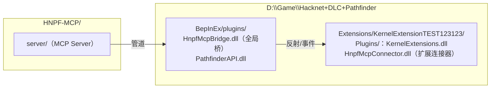
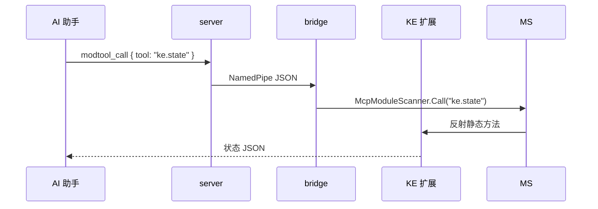
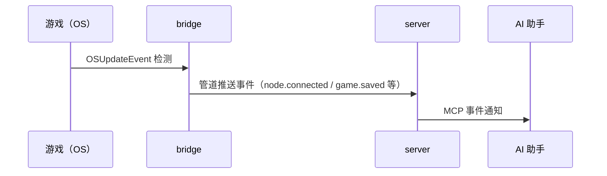

# HNPF-MCP 架构图

> 三层抽象 + 部署拓扑 + 调用链。配套《设计.md》使用。

## 一、总体架构（三层抽象）

```mermaid
flowchart TB
    subgraph 宿主层["MCP 宿主（WorkBuddy / Claude Desktop / DeepSeek 等）"]
        AI["AI 助手（LLM）"]
    end

    subgraph 服务层["server/（Node.js MCP Server，35+ 工具）"]
        S["index.js<br/>工具注册 / 审计 / 快照 / prompts"]
        B["bridge.js<br/>NamedPipe 客户端"]
    end

    subgraph 桥接层["bridge/（HnpfMcpBridge.dll，BepInEx 全局插件）"]
        P["PipeServer<br/>\\\\.\\pipe\\hnpf-mcp-bridge[-pid]"]
        EX["Executor<br/>L1 游戏通用（30+ 方法）"]
        RG["Registry<br/>L2 模组能力反射"]
        MS["McpModuleScanner<br/>L3 [McpTool] 扫描"]
        ME["MenuExecutor<br/>主菜单进扩展（Harmony patch）"]
    end

    subgraph 游戏层["Hacknet + Pathfinder 5.3.4"]
        G["游戏进程"]
        KE["KE 扩展（KernelExtensions.dll）"]
        CON["连接器（HnpfMcpConnector.dll）"]
    end

    AI -->|MCP stdio| S
    S -->|NamedPipe JSON| P
    P --> EX --> G
    P --> ME --> G
    EX --> RG -->|反射| KE
    MS -->|扫描 [McpTool]| CON -->|ke.* 工具| KE
```

## 二、部署拓扑



- **桥是全局插件**：游戏启动即加载，管道监听；多开时自动改 `hnpf-mcp-bridge-{pid}`
- **连接器是扩展插件**：进扩展后由 Pathfinder 加载（主菜单程序化进扩展时 bridge 兜底 Assembly.LoadFrom + 重扫）

## 三、调用链示例（AI 读 KE 状态）



## 四、事件流（游戏 → AI）



## 五、关键机制速记

| 机制 | 位置 | 说明 |
|---|---|---|
| L1 游戏通用 | bridge/Executor.cs | 反射 Hacknet.OS/Computer 等（Patcher 公开化 → 反射 Public\|NonPublic 都加） |
| L2 registry | bridge/Events.cs | Action/exe/daemon/命令反射 + XmlDoc 读模组 XML 注释（参数语义） |
| L3 连接器 | connector/ + McpModuleScanner | [McpTool] 静态方法自动发现 |
| 主菜单进扩展 | bridge/MenuExecutor.cs | 模拟 PF 插件确认（approvedInfo）+ ActivateExtensionPage → 插件真正加载 |
| 多开 | PipeServer 自动改名 | 管道占用 → `-{pid}`；server `pipe_probe` + HNPF_PIPE 指定 |
| 存档快照 | server/snapshots/ | 时间戳快照，保留 20 份，优先当前扩展会话 |
| 安全 | cfg Safety 段 | 白名单/黑名单/只读（热加载）；PipeToken/AutoToken |
